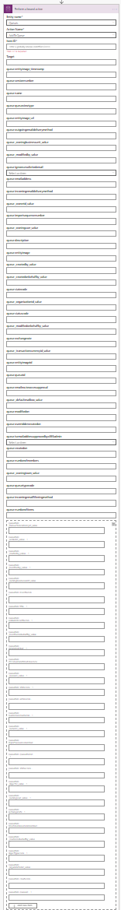
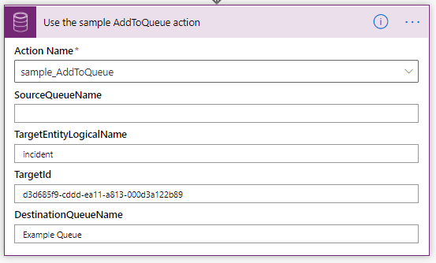
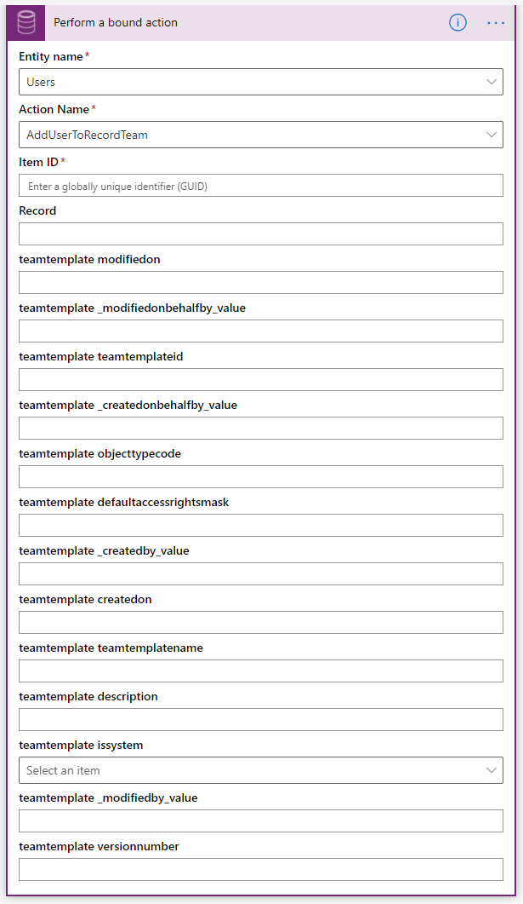
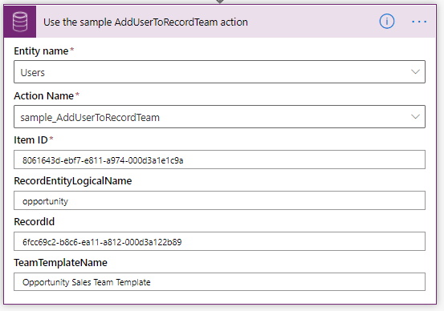

# Dataverse PowerAutomate Helpers

Contains Custom Actions that provide workarounds for Dataverse Actions that have issues in Power Automate Common Data Service (Current Environment)

There are some out-of-the-box actions which are not usable as bound or unbound actions when called from the Power Automate Common Data Service (Current Environment) connector.

This repo contains definitions of custom actions defined using the new [Custom API feature](https://docs.microsoft.com/powerapps/developer/common-data-service/custom-api) to provide a different interface that is easier for the connector to render.

These actions are included in solutions (managed and unmanaged) in this Repo.

Below is a list of the available APIs:

- [sample_AddToQueue](#sample_addtoqueue)
- [sample_AddUserToRecordTeam](#sample_AddUserToRecordTeam)

## sample_AddToQueue

This custom action simplifies the OOTB AddToQueue action by exposing only 4 Fields. Rather than being bound to the Queue entity, it is an unbound action.

|Name|Type|Description|Is Required
|--|--|--|--|
|SourceQueueName|String|The name of the queue that the item should be moved from|No|
|TargetEntityLogicalName|String|The logical name of the entity that represents the item to add to the queue|Yes|
|TargetId|Guid|The Id of the item to add to the queue|Yes|
|DestinationQueueName|String|The name of the queue to add the item to|Yes|

Rather than requiring the GUID Id values to identify the Source or Destination Queues, you can just use the name of the queue and that value will be used to lookup the ID. Of course, if you change the names of these queues, the flow will be broken, but this would also probably break any preceding steps required to retrieve the GUID Id values.

### Before

It is literally too long to capture a screenshot of the whole thing:

### After

## sample_AddUserToRecordTeam

This custom action simplifies the OOTB AddUserToRecordTeam action by exposing only 4 fields.
This is also an action bound to the System User entity.

|Name|Type|Description|Is Required
|--|--|--|--|
|Item ID|GUID|The Id of the user to add to the record team|Yes|
|RecordEntityLogicalName|String|The logical name of the entity that matches the Team Template entity type|Yes|
|RecordId|GUID|The id of the record to create the access team for|Yes|
|TeamTemplateName|String|The name of team template which is used to create the access team.|Yes|

Rather than requiring GUID ID values, this action lets you set the name of the team template and will lookup the ID for you.

This function will also confirm that the RecordEntityLogicalName matches the type that is valid for the Team Template

### Before

There are a lot of unneeded fields about the team template, when all that is needed is the GUID value.

### After

