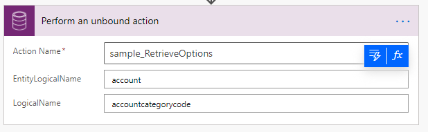

# Dataverse PowerAutomate Helpers

Contains Custom Actions that provide workarounds for Dataverse Actions that have issues in Power Automate Common Data Service (Current Environment) connector.

There are some out-of-the-box actions which are not usable as bound or unbound actions when called from the Power Automate Common Data Service (Current Environment) connector.

This repo contains definitions of custom actions defined using the new [Custom API feature](https://docs.microsoft.com/powerapps/developer/common-data-service/custom-api) to provide a different interface that is easier for the connector to render.

These actions are included in solutions (managed and unmanaged) in this Repo. If you want to try these, download the managed solution and install in your environment. They will appear in the Common Data Service (Current Environment) connector.

Below is a list of the available APIs:

- [sample_AddToQueue](#sample_addtoqueue)
- [sample_AddUserToRecordTeam](#sample_AddUserToRecordTeam)
- [sample_RetrieveOptions](#sample_RetrieveOptions)

If there are other Actions you want to use but are not able to, please open an issue for this GitHub repo.

You are also welcome to contribute by adding your own alternative custom actions.

## sample_AddToQueue

This custom action simplifies the OOTB AddToQueue action by exposing only 4 Fields. Rather than being bound to the Queue entity, it is an unbound action.

|Name|Type|Description|Is Required
|--|--|--|--|
|SourceQueueName|String|The name of the queue that the item should be moved from|No|
|TargetEntityLogicalName|String|The logical name of the entity that represents the item to add to the queue|Yes|
|TargetId|Guid|The Id of the item to add to the queue|Yes|
|DestinationQueueName|String|The name of the queue to add the item to|Yes|

Rather than requiring the GUID Id values to identify the Source or Destination Queues, you can just use the name of the queue and that value will be used to lookup the ID. Of course, if you change the names of these queues, the flow will be broken, but this would also probably break any preceding steps required to retrieve the GUID Id values.

### Before

It is literally too long to capture a screenshot of the whole thing:


### After


## sample_AddUserToRecordTeam

This custom action simplifies the OOTB AddUserToRecordTeam action by exposing only 4 fields.
This is also an action bound to the System User entity.

|Name|Type|Description|Is Required
|--|--|--|--|
|Item ID|GUID|The Id of the user to add to the record team|Yes|
|RecordEntityLogicalName|String|The logical name of the entity that matches the Team Template entity type|Yes|
|RecordId|GUID|The id of the record to create the access team for|Yes|
|TeamTemplateName|String|The name of team template which is used to create the access team.|Yes|


Rather than requiring GUID ID values, this action lets you set the name of the team template and will lookup the ID for you.

This function will also confirm that the RecordEntityLogicalName matches the type that is valid for the Team Template

### Before

There are a lot of unneeded fields about the team template, when all that is needed is the GUID value.


### After


## sample_RetrieveOptions

This Custom API addresses the need that many people have expressed to be able to retrieve the valid options for a given entity attribute. The Web API doesn't expose the equivalent to the [RetrieveOptionSet message](https://docs.microsoft.com/en-us/dotnet/api/microsoft.xrm.sdk.messages.retrieveoptionsetrequest?view=dynamics-general-ce-9) found in the SDK. But even this message is limited in capability because it only returns information about Global optionsets. There are many 'local' optionsets which are not defined globally.

Retrieving information about local optionsets in the Web API is made more complicated because the `OptionSet` property isn't part of the base `AttributeMetadata` class. It is only found in specific classes derived from `AttributeMetadata`. This requires that you know the sub-type before you send your request and cast the attribute in the URL, and there are five different types of attributes with options.

For example, if you want to get the options for an ordinary [PicklistAttributeMetadata](https://learn.microsoft.com/power-apps/developer/data-platform/webapi/reference/picklistattributemetadata) attribute, you need to compose a URL like this:

`GET [Organization URI]/api/data/v9.2/EntityDefinitions(LogicalName='account')/Attributes(LogicalName='accountcategorycode')/Microsoft.Dynamics.CRM.PicklistAttributeMetadata/OptionSet?$select=Options`

However, the following classes also support OptionSets:

- [BooleanAttributeMetadata](https://learn.microsoft.com/power-apps/developer/data-platform/webapi/reference/booleanattributemetadata)
- [MultiSelectPicklistAttributeMetadata](https://learn.microsoft.com/power-apps/developer/data-platform/webapi/reference/multiselectpicklistattributemetadata)
- [StateAttributeMetadata](https://learn.microsoft.com/power-apps/developer/data-platform/webapi/reference/stateattributemetadata)
- [StatusAttributeMetadata](https://learn.microsoft.com/power-apps/developer/data-platform/webapi/reference/statusattributemetadata)

More information [Query metadata using the Web API > Retrieving attributes](https://learn.microsoft.com/power-apps/developer/data-platform/webapi/query-metadata-web-api#retrieving-attributes)

What a Power Automate user expects is a simple way to retrieve the valid options without a lot of complexity. This Custom API provides this by requiring just two string values:

|Name|Type|Description|Is Required
|--|--|--|--|
|EntityLogicalName|String|The LogicalName of the entity that contains the attribute.|Yes|
|LogicalName|String|The LogicalName of the attribute that contains the options. |Yes|



This Custom API uses an `EntityCollection` return type. The Web API definition for the action looks like this:

```xml
<Action Name="sample_RetrieveOptions">
    <Parameter Name="EntityLogicalName" Type="Edm.String" Nullable="false" Unicode="false" />
    <Parameter Name="LogicalName" Type="Edm.String" Nullable="false" Unicode="false" />
    <ReturnType Type="Collection(mscrm.crmbaseentity)" Nullable="false" />
</Action>
```

If you call the `sample_RetrieveOptions` action from PostMan, you can see the type of response expected:

**Request**

```http
POST {{webapiurl}}sample_RetrieveOptions

{
    "EntityLogicalName" : "account",
    "LogicalName":"accountcategorycode"
}
```


**Response Body**

```json
{
    "@odata.context": "{{webapiurl}}$metadata#expando",
    "value": [
        {
            "@odata.type": "#Microsoft.Dynamics.CRM.expando",
            "value": 1,
            "label": "Preferred Customer"
        },
        {
            "@odata.type": "#Microsoft.Dynamics.CRM.expando",
            "value": 2,
            "label": "Standard"
        }
    ]
}
```

This JSON data is what is returned by Power Automate:


